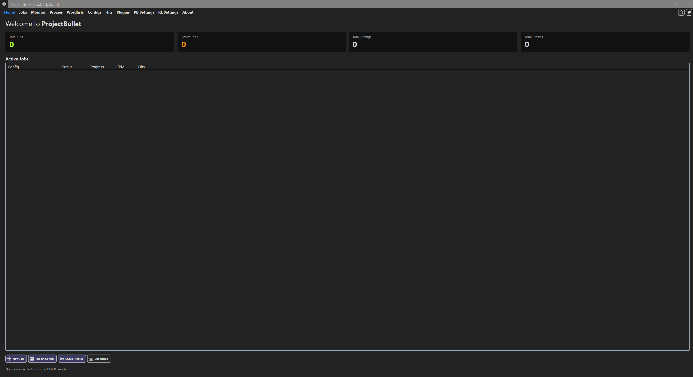
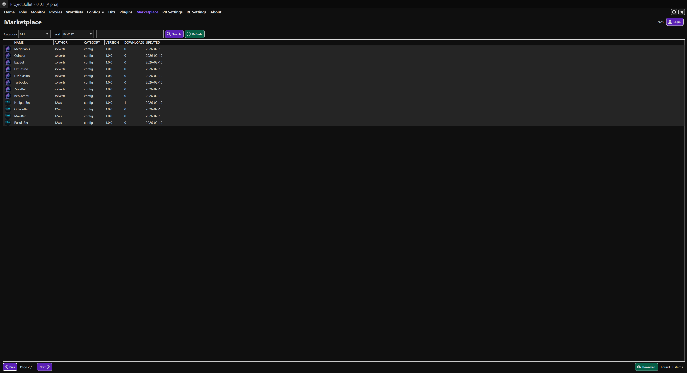
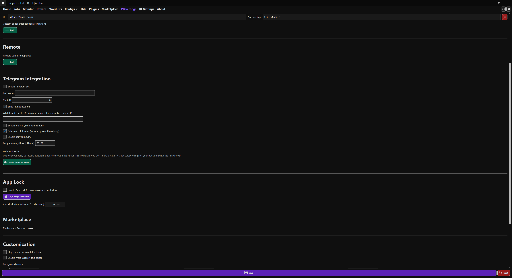
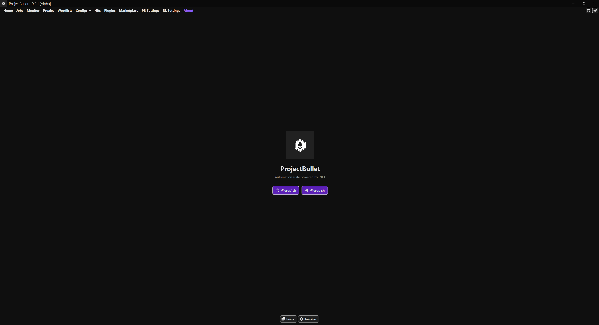

# ProjectBullet

A powerful, extensible automation and testing toolkit built with .NET 9. ProjectBullet provides a rich set of tools for HTTP request automation, credential testing, proxy management, and more — available as both a native Windows (WPF) application and a cross-platform (Avalonia UI) application for Windows, macOS, and Linux.

## Screenshots

| Home | Monitor | Marketplace |
|------|---------|-------------|
|  |  |  |

| Settings | About |
|----------|-------|
|  |  |

## Downloads

### Cross-Platform (Avalonia UI) — Windows, macOS, Linux
| Platform | Architecture | Download |
|----------|-------------|----------|
| Windows | x64 | `ProjectBullet.Avalonia-win-x64.zip` |
| Windows | ARM64 | `ProjectBullet.Avalonia-win-arm64.zip` |
| Linux | x64 | `ProjectBullet.Avalonia-linux-x64.zip` |
| Linux | ARM64 | `ProjectBullet.Avalonia-linux-arm64.zip` |
| macOS | x64 (Intel) | `ProjectBullet.Avalonia-osx-x64.zip` |
| macOS | ARM64 (Apple Silicon) | `ProjectBullet.Avalonia-osx-arm64.zip` |

### Windows Only (WPF — Legacy)
| Platform | Architecture | Download |
|----------|-------------|----------|
| Windows | x64 | `ProjectBullet.Native-win-x64.zip` |
| Windows | x86 | `ProjectBullet.Native-win-x86.zip` |
| Windows | ARM64 | `ProjectBullet.Native-win-arm64.zip` |

Download the latest release from [Releases](https://github.com/eros1sh/ProjectBullet/releases).

## Features

### Cross-Platform Support (New in v0.0.4)
- **Avalonia UI** — Full cross-platform desktop application supporting Windows, macOS (Intel & Apple Silicon), and Linux
- **Feature Parity** — All features from the WPF version are available in the Avalonia version
- **Native Look & Feel** — Uses FluentAvalonia for modern, platform-adaptive theming
- **Same Codebase** — Core logic, Telegram bot, and automation engine are shared between both UI frontends

### Core Functionality
- **Multi-Run Job Engine** — Execute configs against large data sets with parallel processing, customizable bot counts, and real-time statistics (CPM, hits, progress)
- **LoliCode / LoliScript** — Write automation scripts using a simple, domain-specific language with visual block-based editing or raw code
- **Config System** — Create, import, export, and manage automation configs with built-in metadata, categories, and password protection (.opk / .pbc formats)
- **Wordlist Management** — Import and manage large wordlists with support for multiple data types and slicing
- **Hit Storage** — Automatically store, search, export, and deduplicate hits with capture data

### HTTP & Networking
- **HTTP/2 Support** — Native HTTP/2 protocol support via .NET SystemNet library, configurable per-request
- **HTTP/3 (QUIC) Support** — Experimental HTTP/3 support via SocketsHttpHandler on supported platforms
- **TLS Fingerprint Profiles** — Mimic real browser TLS fingerprints (Chrome 120, Firefox 121, Safari 17, Edge 120) with browser-specific cipher suite ordering to avoid detection
- **Anti-Detection Header Profiles** — Automatically apply browser-accurate headers including `Sec-CH-UA`, `Sec-Fetch-*`, and proper `Accept` headers per browser profile
- **Proxy Support** — HTTP, SOCKS4, SOCKS4a, and SOCKS5 proxy support with automatic rotation, health checking, and proxy sources
- **Cloudflare Bypass** — Built-in Puppeteer-based Cloudflare challenge solver with configurable timeout and cookie extraction
- **Cookie Management Blocks** — Save, load, clear, get, set, delete cookies; export/import in Netscape format

### Automation Blocks
- **HTTP Requests** — GET, POST, PUT, DELETE, PATCH, multipart, raw, and basic auth with full header control
- **GraphQL Requests** — Send GraphQL queries with variables, operation names, and custom headers
- **gRPC Requests** — Make gRPC unary calls with raw protobuf bytes or JSON transcoding
- **DNS Lookup** — Resolve hostnames to IPv4/IPv6, reverse DNS lookup, and get local hostname
- **DNS-over-HTTPS** — Secure DNS queries via Cloudflare or Google DoH endpoints with JSON response parsing
- **MQTT Protocol** — Connect, publish, subscribe, and receive messages from MQTT brokers with QoS and TLS support
- **TOTP/HOTP Generation** — Generate and validate RFC 6238/4226 time-based and counter-based one-time passwords
- **QR Code Generation** — Generate QR codes as PNG bytes, Base64 strings, or files
- **XML Parsing** — XPath queries, attribute extraction, inner text, element counting, and element name listing
- **HTML Form Parsing** — Extract form fields, action URLs, methods, and set field values for automated form submission
- **Retry & Loop Control** — Configurable retry with exponential backoff, while loops with max iterations, and delay blocks
- **Variable Watch** — Debug blocks to enumerate, inspect, and log variable values during execution
- **TOR Proxy Integration** — Set SOCKS5 proxy to local TOR instance, request new circuits, and verify TOR connection
- **Python Script Execution** — Execute Python scripts, evaluate expressions, and pass variables via IronPython
- **Puppeteer Browser Automation** — Headless/headful Chrome control for JavaScript-heavy sites
- **String Functions** — Comprehensive string manipulation (regex, replace, split, substring, encoding, hashing)
- **Crypto** — AES, RSA, HMAC, SHA, MD5, Base64, JWT, and more — optimized with .NET 9 static HashData APIs
- **Math Functions** — Arithmetic, rounding, min/max, trigonometry, logarithms, and expression evaluation
- **DateTime Functions** — Parse, format, add/subtract, Unix timestamps, timezone conversion, and component extraction
- **Random Functions** — Random integers, floats, strings, passwords, GUIDs, hex, bytes, and weighted selection
- **JSON Functions** — JsonPath queries, value set/remove, deep merge, array operations, and pretty print
- **List & Dictionary Functions** — Comprehensive collection operations (contains, take, skip, reverse, merge, keys, values)
- **UDP Communication** — Send and receive UDP datagrams with configurable timeouts
- **Captcha Solving** — Integration with popular captcha solving services
- **Interop** — Execute external programs, PowerShell scripts, and system commands

### User Interface
- **Config Favorites & Pinning** — Star your most-used configs to keep them at the top of the list
- **Drag & Drop Config Import** — Drop `.opk` or `.pbc` files directly onto the config list to import
- **Customizable Themes** — Full color customization for backgrounds, text, buttons, and status indicators
- **Background Images** — Set custom background images with opacity control
- **Job Monitor** — Redesigned real-time monitoring with summary cards, overall progress bar, per-job progress bars, colored status indicators, and hit rate tracking
- **Built-in Debugger** — Step through configs with variable inspection and breakpoints
- **Syntax Highlighting** — Enhanced LoliCode editor with category-based keyword coloring (Network, Crypto, Data, Debug blocks)
- **Auto-Save** — Configs are automatically saved every 2 minutes while editing

### Marketplace
- **Full API Integration** — Browse, search, download, upload, and manage configs/plugins via `projectbullet.eros.sh/api`
- **HWID-Based Authentication** — Automatic device identification with optional username/password registration
- **Persistent Login** — Users stay logged in across app restarts; auth tokens are validated on startup
- **Browser Login** — Generate one-time login links to authenticate on the web panel without re-entering credentials
- **Config Download** — Download configs directly to `UserData/Configs/` folder for immediate use
- **Auto-Sync** — Automatically download your shared configs when you log in
- **Publish from Editor** — Publish or update configs to the marketplace directly from the config editor page
- **Search & Filter** — Filter by category (config/plugin), sort by newest/oldest/downloads/name, full-text search with pagination
- **User Avatars** — Display user avatars from the marketplace server in the items list
- **Update Own Items** — Update button appears only for your own marketplace items

### Integrations
- **Telegram Bot** — Control ProjectBullet remotely via Telegram:
  - `/start`, `/help` — Bot info and command list
  - `/status` — View running job statuses
  - `/stats` — Detailed statistics (total hits, CPM, success rates)
  - `/configs` — List available configs
  - `/proxies` — Proxy pool statistics
  - `/search <query>` — Search through hits
  - Hit notifications with enhanced format (proxy, capture, timestamp)
  - Job start/stop notifications
  - Daily summary reports at configurable times
- **Telegram Webhook Relay** — Receive Telegram bot updates through a server-side relay for users without static IPs
- **Remote Configs** — Load configs from remote endpoints

### Captcha Solving
- **Multi-Provider Support** — Integrations with popular captcha solving services
- **12ws (wssolver.net)** — New captcha provider block for configs
- **solvertr (solver.tr)** — New captcha provider block for configs

### Auto-Update
- **Automatic Updates** — The app checks GitHub for new releases daily; when a new version is found, a 10-second countdown dialog appears and the update proceeds automatically
- **Silent Updater** — The standalone updater supports `--silent` mode for non-interactive updates
- **User Data Preservation** — All user data is preserved during updates
- **Running Job Protection** — Auto-update is skipped when jobs are actively running
- **Auto-Relaunch** — In silent mode, the updater automatically relaunches ProjectBullet after a successful update

### Security
- **App Lock** — Protect the application with a password (BCrypt hashed) on startup
- **Config Encryption** — Encrypt configs with password protection for secure sharing
- **Plugin Sandboxing** — Plugins run within the application's managed environment

### Performance
- **Channel-Based Parallelizer** — Task distribution engine uses `System.Threading.Channels` for efficient producer-consumer pattern with built-in backpressure
- **SQLite WAL Mode** — Write-Ahead Logging enabled for better concurrent read/write performance
- **ListView Virtualization** — Hit and job lists use UI virtualization with recycling for smooth scrolling with large datasets
- **Static HashData APIs** — All hash/HMAC computations use .NET 9 zero-allocation static `HashData()` methods
- **FrozenDictionary** — Type-mapping lookups in block descriptors use `System.Collections.Frozen` for faster read-only dictionary access
- **Fast Line Counting** — `FileDataPool` uses buffered byte-scanning with `ArrayPool<byte>` for wordlist line counting
- **Span-Based Operations** — Leverages `Span<byte>` and `ReadOnlySpan` across crypto and data processing paths

## Requirements

### Cross-Platform (Avalonia)
- **Operating System**: Windows 10/11, macOS 12+, Linux (x64 or ARM64)
- **Runtime**: [.NET 9.0 Runtime](https://dotnet.microsoft.com/download/dotnet/9.0)

### Windows Only (WPF)
- **Operating System**: Windows 10/11 (x64, x86, or ARM64)
- **Runtime**: [.NET 9.0 Desktop Runtime](https://dotnet.microsoft.com/download/dotnet/9.0)

## Installation

### From Release (Recommended)
1. Download the latest release from [Releases](https://github.com/eros1sh/ProjectBullet/releases)
2. Extract the ZIP archive to a folder of your choice
3. Install the appropriate .NET 9.0 runtime for your platform
4. Run the executable:
   - **Windows (Avalonia)**: `ProjectBullet.Avalonia.exe`
   - **Windows (WPF)**: `ProjectBullet.Native.exe`
   - **Linux**: `./ProjectBullet.Avalonia`
   - **macOS**: `./ProjectBullet.Avalonia`

### Build from Source
```bash
# Clone the repository
git clone https://github.com/eros1sh/ProjectBullet.git
cd ProjectBullet

# Build WPF version (Windows only)
dotnet publish ProjectBullet.Native -c Release -r win-x64 -o ./publish/native

# Build Avalonia version (cross-platform)
dotnet publish ProjectBullet.Avalonia -c Release -r win-x64 -o ./publish/avalonia-win
dotnet publish ProjectBullet.Avalonia -c Release -r linux-x64 -o ./publish/avalonia-linux
dotnet publish ProjectBullet.Avalonia -c Release -r osx-x64 -o ./publish/avalonia-mac
dotnet publish ProjectBullet.Avalonia -c Release -r osx-arm64 -o ./publish/avalonia-mac-arm
```

## Project Structure

```
ProjectBullet/
├── RuriLib/                          # Core automation library
│   ├── Blocks/                       # Automation blocks (HTTP, Puppeteer, Crypto, etc.)
│   ├── Functions/                    # HTTP client factory, crypto, parsing
│   ├── Models/                       # Configs, jobs, hits, proxies, settings
│   └── Services/                     # Plugin repository, settings services
├── RuriLib.Http/                     # Custom HTTP client library
├── RuriLib.Proxies/                  # Proxy client library (HTTP/SOCKS4/5)
├── RuriLib.Parallelization/          # Parallel execution engine (Channel<T> based)
├── ProjectBullet.Core/               # Application core (EF Core, repositories, services)
├── ProjectBullet.Avalonia/           # Cross-platform desktop app (Avalonia UI)
│   ├── Views/Pages/                  # AXAML pages
│   ├── Views/Dialogs/                # AXAML dialog windows
│   ├── Controls/                     # Custom AXAML controls
│   ├── ViewModels/                   # MVVM view models
│   ├── Helpers/                      # Utilities and converters
│   └── Platforms/                    # Platform-specific abstractions
├── ProjectBullet.Native/             # Windows-only WPF desktop app (legacy)
│   ├── Views/                        # XAML pages and dialogs
│   ├── ViewModels/                   # MVVM view models
│   └── Helpers/                      # Utilities and converters
├── ProjectBullet.Telegram/           # Telegram bot + webhook relay polling
├── ProjectBullet.Native.Updater/     # Auto-updater for the native client
└── ProjectBullet.Console/            # Console runner
```

## Configuration

All user data is stored in the `UserData/` folder:

| Folder | Contents |
|--------|----------|
| `UserData/Configs/` | Automation configs |
| `UserData/Wordlists/` | Imported wordlists |
| `UserData/Plugins/` | Installed plugins |
| `UserData/Logs/` | Job execution logs |
| `UserData/Hits/` | Stored hits database |

### Settings
Application settings are accessible from the **Settings** page and are persisted to `UserData/ProjectBulletSettings.json`:

- **General** — Default config section, bot count behavior, logging, auto-update toggle
- **Customization** — Colors, themes, background images, sounds
- **Telegram** — Bot token, chat ID, notification preferences, daily summaries, webhook relay setup
- **App Lock** — Enable/disable, set password, auto-lock timeout
- **Marketplace** — Authenticated user display, persistent login state

## Tech Stack

- **.NET 9.0** — Runtime and framework
- **Avalonia UI 11.2** — Cross-platform desktop UI with MVVM pattern (Windows, macOS, Linux)
- **WPF** — Windows-only desktop UI with MVVM pattern (legacy)
- **FluentAvalonia 2.2** — Modern, fluent design system for Avalonia
- **Entity Framework Core 9.0** — Data persistence with SQLite (WAL mode)
- **Roslyn 5.0** — C# runtime scripting and compilation
- **Jint 4.5** — JavaScript (ES2024) execution engine
- **IronPython 3.4** — Python 3 scripting support
- **AvaloniaEdit 11.2** — Cross-platform code editor with syntax highlighting
- **LiveCharts2 SkiaSharp** — Real-time charting (Avalonia & WPF)
- **PuppeteerSharp** — Headless Chrome automation
- **Selenium 4.40** — WebDriver browser automation
- **Telegram.Bot** — Telegram Bot API client
- **MailKit 4.14** — SMTP/POP3/IMAP email protocols
- **SSH.NET 2025.1** — SSH protocol support
- **FluentFTP 53.0** — FTP protocol support
- **MQTTnet 4.3** — MQTT protocol support
- **QRCoder 1.6** — QR code generation
- **BCrypt.Net** — Password hashing

## CI/CD

GitHub Actions workflows with manual `workflow_dispatch` trigger support:

- **Build + Release** — Builds both WPF (Windows) and Avalonia (Windows, Linux, macOS) artifacts. Triggered on push to `master` with `[build]` in commit message, or manually.
- **Build + Release | Staging** — Same for `staging` branch with prerelease tagging
- **Run Tests** — Automated test execution on push/PR to `master` and `staging`
- **Docker Build** — Multi-platform Docker image build and push

### Build Artifacts
Each release includes:
- **WPF**: `ProjectBullet.Native-win-x64.zip`, `win-x86.zip`, `win-arm64.zip`
- **Avalonia**: `ProjectBullet.Avalonia-win-x64.zip`, `win-arm64.zip`, `linux-x64.zip`, `linux-arm64.zip`, `osx-x64.zip`, `osx-arm64.zip`
- **Updater**: `pb-native-updater-win-x64.exe`, `win-x86.exe`, `win-arm64.exe`

## Changelog

### v0.0.4 (Current)
- **Cross-Platform Support** — Full Avalonia UI port supporting Windows, macOS, and Linux
- **OpenBullet 2 Migration** — One-click migration tool (from v0.0.3)

### v0.0.3
- **OpenBullet 2 Migration** — One-click migration tool to import existing OB2 data

### v0.0.2
- 17 New Automation Blocks, HTTP/2 & HTTP/3, TLS Fingerprint Profiles, Monitor Redesign, Auto-Save, Channel-Based Parallelizer, SQLite WAL Mode

### v0.0.1
- Initial release with core functionality, marketplace integration, Telegram bot, auto-update system

See [CHANGELOG.md](CHANGELOG.md) for full details.

## Contributing

1. Fork the repository
2. Create a feature branch (`git checkout -b feature/my-feature`)
3. Commit your changes (`git commit -m "Add my feature"`)
4. Push to the branch (`git push origin feature/my-feature`)
5. Open a Pull Request

Please use the [issue templates](.github/ISSUE_TEMPLATE/) for bug reports and feature requests.

## License

This project is open source. See the repository for license details.
